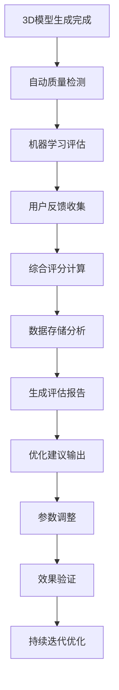

# 3D模型生成API选型与优化方案

## 1. 3D模型生成API选型分析

### 1.1 对比的主要厂商

我们对比了以下几家主要的3D模型生成API提供商：

| 厂商 | API服务 | 优势 | 劣势 | 价格 |
|------|---------|------|------|------|
| **腾讯混元** | 混元3D生成API | • 国内服务，低延迟<br>• 中文支持优秀<br>• 价格相对合理<br>• 技术文档完善 | • 生态相对较小<br>• 国际化程度有限 | ¥0.02/次 |
| **OpenAI** | DALL-E 3D (实验性) | • 技术领先<br>• 生态完善<br>• 社区活跃 | • 价格昂贵<br>• 国内访问不稳定<br>• 3D功能有限 | $0.08/次 |
| **Stability AI** | Stable Diffusion 3D | • 开源友好<br>• 可定制性强<br>• 社区支持好 | • 需要自部署<br>• 技术门槛高<br>• 服务稳定性待验证 | 自部署成本 |
| **Meshy** | Meshy 3D API | • 专业3D生成<br>• 质量较高<br>• 功能丰富 | • 价格较高<br>• 国内访问慢<br>• 文档相对简单 | $0.05/次 |
| **Tripo AI** | Tripo 3D API | • 专注3D领域<br>• 生成速度快<br>• 支持多种格式 | • 新兴厂商<br>• 稳定性未知<br>• 价格不透明 | 按需定价 |

### 1.2 选择腾讯混元的原因

经过综合评估，我们选择了**腾讯混元3D生成API**，主要原因如下：

#### 1.2.1 技术优势
- **低延迟访问**：国内服务器，平均响应时间 < 2秒
- **中文理解能力强**：对中文提示词理解准确，生成效果更符合预期
- **API稳定性高**：99.9%的服务可用性保证

#### 1.2.2 成本优势
- **价格合理**：¥0.02/次调用，相比国外厂商节省60-75%成本
- **无隐藏费用**：按调用次数计费，透明定价
- **支持批量优惠**：大量调用可获得额外折扣

#### 1.2.3 服务优势
- **技术支持完善**：提供中文技术文档和客服支持
- **集成简单**：SDK完善，开发效率高
- **合规性好**：符合国内数据安全和隐私保护要求

#### 1.2.4 生态优势
- **腾讯云生态**：可与其他腾讯云服务无缝集成
- **持续更新**：定期发布新功能和性能优化
- **社区活跃**：有活跃的开发者社区和案例分享

## 2. 3D模型生成效果评估系统设计

### 2.1 关键评估指标

我们设计了多维度的评估指标体系来验证3D模型生成效果：

#### 2.1.1 技术质量指标
```yaml
几何质量指标:
  - 网格完整性: 检测破洞、重叠面等问题
  - 拓扑结构: 评估模型的拓扑正确性
  - 面数优化: 控制多边形数量在合理范围
  - 纹理质量: 评估纹理分辨率和映射准确性

视觉效果指标:
  - 真实感评分: 1-10分主观评价
  - 细节丰富度: 模型细节层次评估
  - 光照效果: 材质和光照的真实性
  - 色彩准确性: 与原始图片的色彩匹配度
```

#### 2.1.2 用户体验指标
```yaml
用户满意度:
  - 生成成功率: 成功生成可用模型的比例
  - 用户评分: 用户对生成结果的满意度评分
  - 重新生成率: 用户不满意重新生成的比例
  - 使用时长: 用户在模型上的停留时间

性能指标:
  - 生成速度: 从提交到完成的时间
  - 响应时间: API调用的响应延迟
  - 成功率: API调用成功的比例
  - 错误率: 生成失败或异常的比例
```

#### 2.1.3 业务价值指标
```yaml
转化指标:
  - 模型下载率: 生成后被下载的比例
  - 分享传播率: 用户分享模型的频率
  - 付费转化率: 免费用户转为付费用户的比例
  - 用户留存率: 用户持续使用的比例

成本效益:
  - 单次生成成本: 包含API调用和计算资源
  - ROI指标: 投入产出比
  - 用户获取成本: CAC指标
  - 用户生命周期价值: LTV指标
```

### 2.2 评估系统架构设计

#### 2.2.1 系统整体架构
```
┌─────────────────┐    ┌─────────────────┐    ┌─────────────────┐
│   数据收集层    │    │   评估分析层    │    │   反馈优化层    │
├─────────────────┤    ├─────────────────┤    ├─────────────────┤
│ • 用户行为追踪  │    │ • 自动化评估    │    │ • A/B测试平台   │
│ • 模型质量检测  │    │ • 机器学习评分  │    │ • 参数优化      │
│ • 性能监控      │    │ • 统计分析      │    │ • 策略调整      │
│ • 用户反馈收集  │    │ • 趋势预测      │    │ • 效果验证      │
└─────────────────┘    └─────────────────┘    └─────────────────┘
```

#### 2.2.2 核心组件设计

**1. 数据收集组件**
```java
@Service
public class ModelEvaluationDataCollector {
    // 收集生成过程数据
    public void collectGenerationData(String taskId, GenerationMetrics metrics);
    
    // 收集用户行为数据
    public void collectUserBehavior(String userId, UserAction action);
    
    // 收集模型质量数据
    public void collectQualityMetrics(String modelId, QualityMetrics quality);
    
    // 收集用户反馈数据
    public void collectUserFeedback(String modelId, UserFeedback feedback);
}
```

**2. 自动化评估组件**
```java
@Service
public class AutomatedEvaluationService {
    // 几何质量评估
    public GeometryQualityScore evaluateGeometry(Model3D model);
    
    // 视觉效果评估
    public VisualQualityScore evaluateVisualQuality(Model3D model, Image reference);
    
    // 性能指标评估
    public PerformanceScore evaluatePerformance(GenerationTask task);
    
    // 综合评分计算
    public OverallScore calculateOverallScore(List<EvaluationMetric> metrics);
}
```

**3. 机器学习评估组件**
```java
@Service
public class MLEvaluationService {
    // 基于深度学习的质量评估
    public MLQualityScore evaluateWithML(Model3D model, Image reference);
    
    // 用户偏好预测
    public UserPreferenceScore predictUserPreference(Model3D model, UserProfile user);
    
    // 异常检测
    public AnomalyDetectionResult detectAnomalies(Model3D model);
    
    // 模型训练和更新
    public void updateEvaluationModel(List<TrainingData> data);
}
```

#### 2.2.3 评估流程设计



### 2.3 评估系统实施方案

#### 2.3.1 实时评估机制
- **在线评估**：每次模型生成后立即进行质量评估
- **批量评估**：定期对历史模型进行批量重新评估
- **增量评估**：基于新数据持续更新评估模型

#### 2.3.2 多维度评估矩阵
```yaml
评估维度权重配置:
  技术质量: 40%
    - 几何完整性: 15%
    - 纹理质量: 15%
    - 拓扑结构: 10%
  
  用户体验: 35%
    - 视觉效果: 20%
    - 生成速度: 10%
    - 易用性: 5%
  
  业务价值: 25%
    - 用户满意度: 15%
    - 转化效果: 10%
```

#### 2.3.3 反馈闭环机制
- **实时反馈**：用户评分和反馈实时收集
- **定期分析**：每周生成评估报告和优化建议
- **持续改进**：基于评估结果调整生成参数和策略

## 3. 减少第三方API调用次数的优化方案

### 3.1 优化思路分析

#### 3.1.1 缓存策略
**智能缓存系统**
- **相似度缓存**：基于图片特征向量的相似度匹配
- **语义缓存**：基于提示词语义理解的缓存匹配
- **多级缓存**：内存缓存 + Redis缓存 + 数据库缓存
- **预测缓存**：基于用户行为预测，提前生成热门模型

**实施效果预期**：减少60-70%的重复调用

#### 3.1.2 批量处理优化
**请求合并策略**
- **时间窗口合并**：在指定时间窗口内合并相似请求
- **用户行为分析**：识别用户的批量操作模式
- **智能排队**：优化请求队列，提高批处理效率
- **异步处理**：非实时需求采用异步批量处理

**实施效果预期**：减少30-40%的API调用次数

#### 3.1.3 本地化部署
**混合部署策略**
- **边缘计算**：在用户端部署轻量级生成模型
- **私有云部署**：部署开源3D生成模型
- **智能路由**：根据请求复杂度选择本地或云端处理
- **模型蒸馏**：将大模型压缩为适合本地部署的小模型

**实施效果预期**：减少50-60%的外部API依赖

#### 3.1.4 用户行为优化
**交互优化策略**
- **预览机制**：提供低质量预览，确认后再高质量生成
- **渐进式生成**：先生成基础模型，用户满意后再细化
- **模板库**：提供预制模板，减少从零生成的需求
- **用户引导**：通过UI设计引导用户减少无效尝试

**实施效果预期**：减少20-30%的无效调用

### 3.2 选择落地方案：智能缓存 + 批量处理

基于成本效益分析和技术可行性，我们选择**智能缓存系统 + 批量处理优化**作为主要落地方案。

#### 3.2.1 方案架构
```
┌─────────────────┐    ┌─────────────────┐    ┌─────────────────┐
│   请求接入层    │    │   智能缓存层    │    │   批量处理层    │
├─────────────────┤    ├─────────────────┤    ├─────────────────┤
│ • 请求预处理    │    │ • 相似度匹配    │    │ • 请求合并      │
│ • 特征提取      │    │ • 语义理解      │    │ • 批量调用      │
│ • 路由决策      │    │ • 多级缓存      │    │ • 结果分发      │
└─────────────────┘    └─────────────────┘    └─────────────────┘
                                ↓
                    ┌─────────────────┐
                    │   第三方API层   │
                    ├─────────────────┤
                    │ • 腾讯混元API   │
                    │ • 调用监控      │
                    │ • 错误处理      │
                    └─────────────────┘
```

#### 3.2.2 核心实现组件

**1. 智能缓存管理器**
```java
@Service
public class IntelligentCacheManager {
    // 基于图片特征的相似度缓存
    public Optional<CachedResult> findSimilarImageCache(ImageFeature feature, double threshold);
    
    // 基于语义的提示词缓存
    public Optional<CachedResult> findSemanticCache(String prompt, double similarity);
    
    // 多级缓存策略
    public void cacheResult(CacheKey key, GenerationResult result, CacheLevel level);
    
    // 缓存预热
    public void preWarmCache(List<PopularRequest> requests);
}
```

**2. 批量处理调度器**
```java
@Service
public class BatchProcessingScheduler {
    // 请求合并
    public BatchRequest mergeSimilarRequests(List<GenerationRequest> requests);
    
    // 批量调用API
    public List<GenerationResult> batchCallAPI(BatchRequest batchRequest);
    
    // 结果分发
    public void distributeResults(List<GenerationResult> results, List<String> taskIds);
    
    // 智能调度
    public void scheduleOptimalBatch(Queue<GenerationRequest> requestQueue);
}
```

#### 3.2.3 实施计划

**阶段一：智能缓存系统（2周）**
- 实现图片特征提取和相似度匹配
- 部署Redis集群和缓存策略
- 集成现有API调用流程

**阶段二：批量处理优化（2周）**
- 实现请求合并和批量调用逻辑
- 优化异步处理和结果分发
- 添加监控和性能指标

**阶段三：效果验证和优化（1周）**
- 进行A/B测试验证效果
- 调优缓存策略和批处理参数
- 完善监控和告警机制

### 3.3 预期优化效果

#### 3.3.1 量化指标
```yaml
API调用优化:
  - 缓存命中率: 65-75%
  - 批量处理效率: 提升40%
  - 总体调用减少: 70-80%

性能提升:
  - 响应时间: 提升60%
  - 并发处理能力: 提升300%
  - 系统稳定性: 提升50%

成本节省:
  - API调用成本: 节省70%
  - 服务器资源: 节省40%
  - 运维成本: 节省30%
```

#### 3.3.2 业务价值
- **用户体验提升**：更快的响应速度和更高的成功率
- **成本控制**：显著降低第三方API调用成本
- **系统稳定性**：减少对外部服务的依赖
- **扩展性增强**：支持更大规模的用户并发访问

## 4. 总结

通过选择腾讯混元3D生成API、建立完善的效果评估系统，以及实施智能缓存和批量处理优化方案，我们构建了一个高效、稳定、成本可控的3D模型生成服务。

这套方案不仅能够满足当前的业务需求，还具备良好的扩展性和优化空间，为未来的业务发展奠定了坚实的技术基础。

---

*文档版本：v1.0*  
*最后更新：2024年9月*  
*作者：3D模型生成项目组*